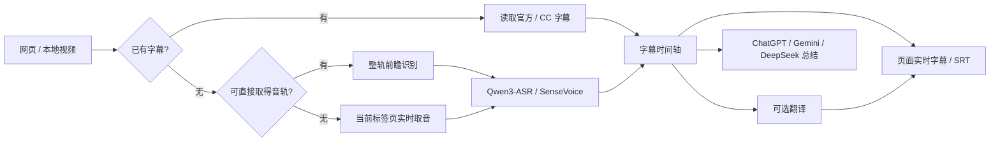

<div align="center">
  
  <h1>全网视频实时字幕与总结</h1>
  <p><b>Browser Live Captions & Summary</b></p>
  <p>浏览器里直接完成 <b>语音 → 文字 → 字幕 → 翻译 → 总结</b>。无需单独部署 ASR 大模型服务。</p>
</div>

## 这是什么？

这是一个 Chrome / Chromium MV3 扩展。安装后，它会尽量直接取得网页视频的字幕或音轨；没有现成字幕时，就在浏览器内用 **Qwen3-ASR 0.6B** 或 **SenseVoice Small** 转写，再把结果显示成实时字幕、导出，或交给 AI 做总结。

你不需要搭一套 Whisper / ASR 服务，也不需要在本机启动独立大模型后端。识别模型由扩展按需下载，并在浏览器的 WebGPU / WASM 环境中运行。字幕翻译则可以连接你自己的本地 OpenAI 兼容接口，也可以使用云端 API。

## 亮点

- **真正的浏览器字幕识别**：没有字幕的视频也能从音轨生成字幕。
- **B 站 + YouTube + 通用视频网站**：优先使用官方/CC 字幕；没有时自动走音轨直取或标签页音频捕获后备。
- **实时字幕与整轨前瞻**：能直接取得音轨时，识别会持续跑在播放进度前面，尽量做到字幕不打断观影。
- **字幕翻译**：整轨音频路径支持本地或远程 OpenAI-compatible API，可只显示译文或双语字幕。
- **视频总结**：字幕可发送到 ChatGPT、Gemini（Google AI Studio）或 DeepSeek；你主动选择目标服务后，附件就绪会自动提交。
- **直播 / 播客 / 本地媒体**：没有可直接读取的字幕或音轨时，可捕获当前标签页声音继续识别。
- **隐私优先**：ASR 默认在浏览器本地执行；远程翻译只在你主动配置对应 API 后发生。

> 对包括 **MissAV** 在内的一些 HLS / MP4 通用站点做过兼容性优化。只要浏览器能拿到可播放音轨，通常就能尝试生成字幕；DRM、登录/付费限制、地区限制或站点改版仍可能阻断音轨读取。剧情党请愉快观影 🙂

## 工作流程



## 支持情况

| 场景 | 支持方式 |
|---|---|
| Bilibili | 官方字幕优先；无字幕时可读取音轨并本地识别 |
| YouTube | CC 优先；无 CC 时尝试音轨识别 |
| 其他视频网站 | M3U8 / MP4 / 可发现音轨优先，失败后回退到标签页声音捕获 |
| 直播 / 播客 | 标签页或媒体元素实时取音 |
| 本地视频/音频 | 浏览器内读取并识别（单文件桥接上限 512 MiB，超出时可走连续播放捕获） |
| 字幕翻译 | 当前针对“可直接取得音轨”的整轨前瞻路径；实时取音后备暂不翻译 |
| 总结 | 有现成字幕或可成功转写时均可使用 |

## 识别后端

- **Qwen3-ASR 0.6B**：WebGPU / FP16，首次模型资源约 1.89 GB。
- **SenseVoice Small**：WebGPU FP16 约 469 MB；CPU WASM INT8 约 240 MB。

首次使用会下载对应模型资源并缓存在浏览器中。模型源支持 Hugging Face、HF Mirror、ModelScope 等。

## 从源码安装

仓库为了保持 Git 历史轻量，没有提交约 23 MB 的 ONNX Runtime WASM 二进制；它来自固定版本的官方 npm 包，并通过 SHA-256 校验恢复。

```bash
git clone https://github.com/cnlove7777777-art/bilibili-subtitle-summary.git
cd bilibili-subtitle-summary
node scripts/restore-ort-runtime.mjs
```

然后打开 `chrome://extensions`：

1. 开启“开发者模式”。
2. 点击“加载已解压的扩展程序”。
3. 选择仓库目录。

要求：Chrome / Chromium 121+；运行恢复脚本需要 Node.js + npm。安装扩展本身没有常驻 Node 依赖。

## 翻译配置

翻译接口采用 OpenAI-compatible `/v1/models` 与 `/chat/completions`：

- **本地服务**：例如 UNSLOTH Studio、llama.cpp、LM Studio 或其他兼容服务。
- **远程 API**：任意你信任的 OpenAI-compatible 服务。

API Key 保存在 Chrome 扩展本地存储中，只会发往你配置的 Base URL。

## 总结方式

点击“总结”后可选择 ChatGPT、Gemini 或 DeepSeek。扩展会准备字幕 TXT 和总结提示词到目标网页，并在确认附件就绪后**自动提交**。选择目标服务即视为启动这次总结发送；如果不希望提交，请不要触发该总结操作。

## 测试

```bash
node tests/verify.mjs
node tests/ui-summary-regressions.mjs
node tests/model-bootstrap.mjs
node tests/scan-audio.mjs
```

当前 0.16.25 会由 GitHub Actions 自动执行静态/回归检查，并在通过后产出可下载的源码 ZIP artifact。真实 WebGPU 性能、不同网站的媒体策略和标签页音频仍需要浏览器与硬件实测。

## 隐私

详细说明见 [`privacy.html`](privacy.html)。项目不运营用于收集用户视频、音频、字幕、提示词或浏览历史的服务器。第三方 AI、模型托管站和你自行配置的 API 会按各自政策处理它们实际收到的数据。

## 开源许可

项目自身代码使用 [MIT License](LICENSE)。第三方组件许可见 [`THIRD_PARTY_NOTICES.txt`](THIRD_PARTY_NOTICES.txt) 与 `vendor/` 下的许可证文件。

欢迎提 Issue、做兼容性测试，或者直接 PR。视频网站的播放器实现天天在变——这种项目开源以后，反而更容易被大家一起养活。
